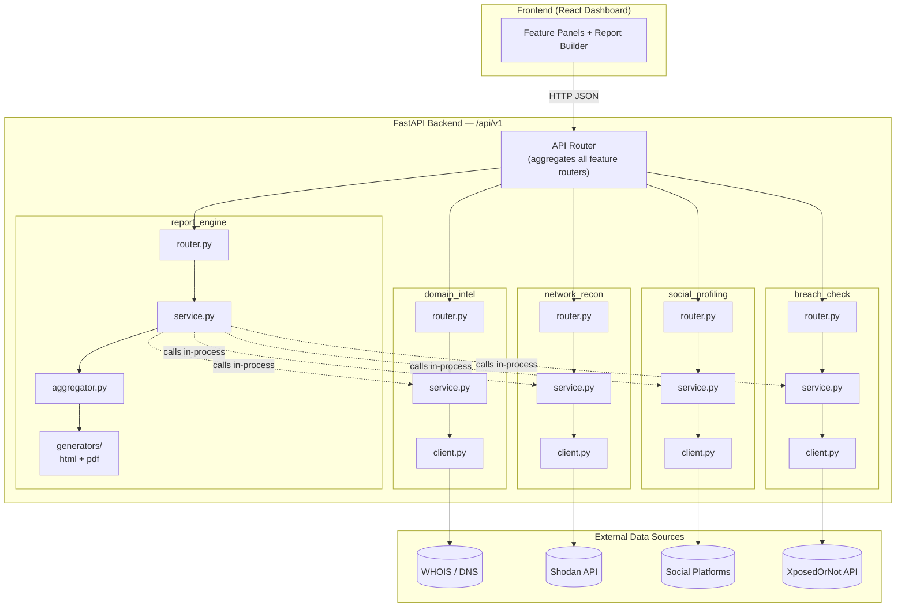
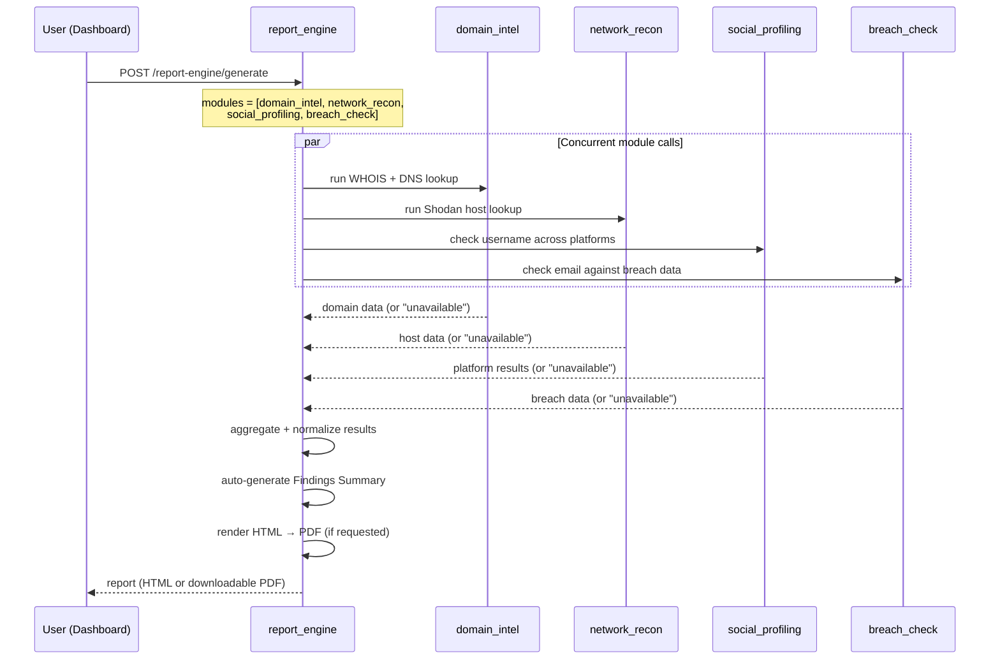

# OSINT Toolkit

A feature-based, modular Open Source Intelligence (OSINT) platform built as an academic cybersecurity mini project. It correlates publicly available information about a domain, IP, username, or email address across multiple free/open OSINT sources, and packages the findings into a downloadable investigation report.

> **Academic project notice:** This tool is built for learning and demonstration purposes as part of an OSINT lab mini project. It queries only public, non-authenticated data sources and does not perform credential access, account enumeration for harassment, or any circumvention of platform security controls. See [Ethics & Scope](#ethics--scope) below.

---

## Table of Contents

- [Overview](#overview)
- [Features](#features)
- [Architecture](#architecture)
- [Request Flow](#request-flow)
- [Tech Stack](#tech-stack)
- [Project Structure](#project-structure)
- [Getting Started](#getting-started)
- [Environment Variables](#environment-variables)
- [API Reference](#api-reference)
- [Testing](#testing)
- [Roadmap](#roadmap)
- [Ethics & Scope](#ethics--scope)
- [Limitations](#limitations)
- [Acknowledgements](#acknowledgements)
- [License](#license)

---

## Overview

OSINT Toolkit is a FastAPI backend paired with a React dashboard. Instead of one monolithic script, each OSINT technique — domain intelligence, network reconnaissance, social profiling, and breach checking — lives in its own self-contained, testable feature module. A fifth module, the **Report Engine**, orchestrates the others and compiles the results into a single exportable HTML/PDF report.

This structure was chosen deliberately over a flat script-based layout: it mirrors how OSINT investigations are actually run (one source at a time, correlated at the end), keeps each external API integration isolated and swappable, and makes the whole thing testable without hitting real third-party services.

## Features

| Module | What it does | Data source |
|---|---|---|
| **Domain Intel** | WHOIS registration data + DNS records (A, AAAA, MX, NS, TXT) | WHOIS protocol, DNS resolution |
| **Network Recon** | Open ports, banners, geolocation for a host; search across indexed hosts | [Shodan](https://www.shodan.io/) |
| **Social Profiling** | Checks public username availability/existence across major platforms | Direct HTTP checks against platform profile URLs |
| **Breach Check** | Checks whether an email appears in known public data breaches | [XposedOrNot](https://xposedornot.com/) (free, no API key) |
| **Report Engine** | Aggregates any combination of the above into one HTML/PDF report with an auto-generated findings summary | Internal — calls the other modules directly |

## Architecture

The backend follows a **feature-based modular architecture**: every OSINT capability is a vertical slice with its own router, service, external-API client, and schemas, rather than being split horizontally across generic `controllers/`, `services/`, `models/` folders shared by everything.



Each module is isolated behind its `client.py` — the only file allowed to know about a given third-party SDK or request format — so a provider can be swapped without touching business logic, and the entire test suite can mock every external call.

## Request Flow

Example: generating a full investigation report for a target that has a domain, an email, and a username.



If any single module fails or wasn't requested, the report still generates — that section is clearly marked "unavailable" or "not requested" rather than failing the whole request.

## Tech Stack

**Backend**
- Python 3.11+, FastAPI, Pydantic v2
- `httpx` (async HTTP), `python-whois`, `dnspython`, `shodan` SDK
- `jinja2` + `weasyprint`/`pdfkit` for report generation
- `pytest` + `httpx`/`respx` mocks for testing

**Frontend**
- React 18 + Vite + TypeScript
- Feature-based folder structure mirroring the backend

## Project Structure

```
osint-toolkit/
├── backend/
│   ├── app/
│   │   ├── core/                # config, logging, exceptions
│   │   ├── shared/                # common schemas, utils
│   │   ├── features/
│   │   │   ├── domain_intel/       # WHOIS + DNS
│   │   │   ├── network_recon/      # Shodan
│   │   │   ├── social_profiling/   # username enumeration
│   │   │   ├── breach_check/       # XposedOrNot
│   │   │   └── report_engine/      # aggregation + PDF/HTML export
│   │   ├── api/v1/                 # versioned route aggregation
│   │   └── main.py
│   ├── tests/
│   ├── requirements.txt
│   └── .env.example
├── frontend/
│   └── src/
│       ├── api/                    # typed API client
│       ├── features/                # one folder per module, mirrors backend
│       └── shared/                  # shared components/hooks
├── docs/
│   ├── phase1-notes.md … phase7-notes.md
│   └── report-support/              # material for the mini-project report
└── README.md
```

## Getting Started

### Prerequisites
- Python 3.11+
- Node.js 18+
- A free [Shodan](https://account.shodan.io/register) API key (host lookups work on the free tier; the search endpoint needs a paid/membership key)
- No key needed for breach checking — [XposedOrNot](https://xposedornot.com/api_doc) is free and open

### Backend

```bash
cd backend
python -m venv .venv
.venv\Scripts\activate        # Windows
# source .venv/bin/activate   # macOS/Linux

pip install -r requirements.txt
copy .env.example .env        # Windows: copy | macOS/Linux: cp
# fill in SHODAN_API_KEY in .env

uvicorn app.main:app --reload
```

Backend runs at `http://127.0.0.1:8000`. Interactive API docs at `http://127.0.0.1:8000/docs`.

### Frontend

```bash
cd frontend
npm install
copy .env.example .env        # set VITE_API_BASE_URL=http://127.0.0.1:8000
npm run dev
```

Dashboard runs at `http://127.0.0.1:5173`.

## Environment Variables

| Variable | Required | Used by | Notes |
|---|---|---|---|
| `SHODAN_API_KEY` | Yes | `network_recon` | Free tier supports host lookups; search needs a paid key |
| `XON_BASE_URL` | No | `breach_check` | Defaults to `https://api.xposedornot.com`; no key needed |
| `VITE_API_BASE_URL` | Yes (frontend) | all frontend panels | Backend base URL |

## API Reference

All endpoints are versioned under `/api/v1` and return a standard envelope:
```json
{ "success": true, "data": { }, "meta": { "queried_at": "..." }, "error": null }
```

| Method | Endpoint | Description |
|---|---|---|
| `GET` | `/domain-intel/whois?domain=` | WHOIS lookup |
| `GET` | `/domain-intel/dns?domain=` | DNS record lookup |
| `GET` | `/network-recon/host?ip=` | Shodan host lookup |
| `GET` | `/network-recon/search?query=&page=` | Shodan search (requires paid Shodan tier) |
| `GET` | `/social-profiling/username?value=` | Username existence check across platforms |
| `GET` | `/breach-check/email?value=` | Email breach check |
| `POST` | `/report-engine/generate` | Generate an aggregated HTML/PDF report |
| `GET` | `/report-engine/preview/{report_id}` | Retrieve a cached report preview |
| `GET` | `/health` | Health check |

Full interactive reference: `/docs` (Swagger UI) when the backend is running.

## Testing

```bash
cd backend
pytest
```

Every module's test suite mocks its external dependency (WHOIS/DNS, Shodan, platform HTTP checks, XposedOrNot) — no real network calls or API keys are required to run the tests.

## Roadmap

- [x] Phase 1 — Scaffolding + `domain_intel`
- [x] Phase 2 — `network_recon` (Shodan)
- [x] Phase 3 — `social_profiling`
- [x] Phase 4 — `breach_check` (XposedOrNot)
- [x] Phase 5 — `report_engine`
- [x] Phase 6 — Frontend dashboard
- [x] Phase 7 — Hardening, docs, report-support artifacts

Future ideas: authentication/multi-user support, persistent report storage, scheduled/recurring scans, additional OSINT sources.

## Ethics & Scope

This project only collects **public** information and never attempts credential access, private data scraping, or circumvention of platform controls. A username or email match across sources is treated as an investigative **lead**, not proof of identity. See `docs/phase3-notes.md`, `docs/phase4-notes.md`, and `docs/report-support/known-limitations.md` for the full scope discussion.

## Limitations

- Prototype-only: no authentication, no persistent database, in-memory/temp-file caching only
- Free-tier API limits apply (Shodan search, XposedOrNot rate limits)
- OSINT results are point-in-time and may contain false positives/negatives — findings should be corroborated

See `docs/report-support/known-limitations.md` for the complete list.

## Acknowledgements

- [Shodan](https://www.shodan.io/) — internet-connected device search
- [XposedOrNot](https://xposedornot.com/) — free, open-source breach data API
- WHOIS/DNS protocol libraries (`python-whois`, `dnspython`)

## License

This project was built for academic purposes as part of an OSINT lab mini project. Add your preferred license (e.g. MIT) here before publishing.
